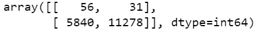
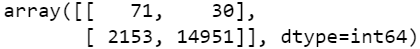

# Credit_Risk_Analysis

## Balanced Accuracy Score

Model|Accuracy
---|---
Naive Random Oversampling|
SMOTE Oversampling|
Cluster Centroids|
SMOTEENN|
Balanced Random Forest|
Easy Ensemble AdaBoost|

## Imbalanced Classification Report

Model|Imbalanced Classification Report
---|---
Naive Random Oversampling|
SMOTE Oversampling|
Cluster Centroids|
SMOTEENN|
Balanced Random Forest|
Easy Ensemble AdaBoost|

## Confusion Matrix

Model|Confusion Matrix
---|---
Naive Random Oversampling|
SMOTE Oversampling|
Cluster Centroids|
SMOTEENN|
Balanced Random Forest|
Easy Ensemble AdaBoost|

## Balanced Random Forest: features sorted in descending order by feature importance

Feature|Explanation|Importance
---|---|---
total_pymnt_inv|Payments received to date for portion of total amount funded by investors|0.0727639593858621
last_pymnt_amnt|Last total payment amount received|0.06834306477244799
total_rec_prncp|Principal received to date|0.06782335661147988
total_pymnt|Payments received to date for total amount funded|0.05739610678680039
total_rec_int|Interest received to date|0.05720777169836709
out_prncp|Remaining outstanding principal for total amount funded|0.020688645276999505
installment|The monthly payment owed by the borrower if the loan originates|0.02036466881582304
out_prncp_inv|Remaining outstanding principal for portion of total amount funded by investors|0.018656936727152965
dti|A ratio calculated using the borrower’s total monthly debt payments on the total debt obligations, excluding mortgage and the requested LC loan, divided by the borrower’s self-reported monthly income.|0.017857917342116038
max_bal_bc|Maximum current balance owed on all revolving accounts|0.01601229614899384
