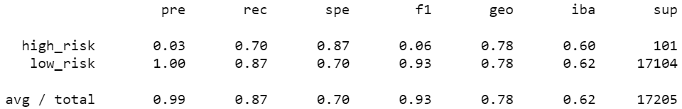

# Credit_Risk_Analysis

## Purpose

The purpose of the analysis below is to assess the performance of different machine learning models with unbalanced classes used to predict LendingClub loan risks.

## Balanced Accuracy Score

Model|Accuracy
---|---
Naive Random Oversampling|
SMOTE Oversampling|
Cluster Centroids|
SMOTEENN|
Balanced Random Forest|
Easy Ensemble AdaBoost|

Balanced Random Forest and Easy Ensemble AdaBoost give huge leap each in terms of accuracy score. How could we see this in a more obvious way? Confusion matrix is going to help us with that.

## Confusion Matrix

Model|Confusion Matrix
---|---
Naive Random Oversampling|
SMOTE Oversampling|
Cluster Centroids|
SMOTEENN|
Balanced Random Forest|
Easy Ensemble AdaBoost|

We see at once what is so good about the last two models: sensitivity for high-risk loans 15/17 and 16/17 is far better any of the first four models. The Imbalanced Classification Reports below are even more obvious for that.

## Imbalanced Classification Report

Model|Imbalanced Classification Report
---|---
Naive Random Oversampling|
SMOTE Oversampling|
Cluster Centroids|
SMOTEENN|
Balanced Random Forest|
Easy Ensemble AdaBoost|

As I see it, the only model giving practically applicable result is Easy Ensemble AdaBoost. Only this model is sensitive enough to spot more than 90% of high-risk loans. For further gauging all six models see the section "Recommendations on which model to use"

## Balanced Random Forest: features sorted in descending order by feature importance

Feature|Explanation|Importance
---|---|---
total_rec_prncp|Principal received to date|0.07876809003486353
total_pymnt|Payments received to date for total amount funded|0.05883806887524815
total_pymnt_inv|Payments received to date for portion of total amount funded by investors|0.05625613759225244
total_rec_int|Interest received to date|0.05355513093134745
last_pymnt_amnt|Last total payment amount received|0.0500331813446525
int_rate|Interest Rate on the loan|0.02966959508700077
issue_d_Jan-2019|The month which the loan was funded|0.021129125328012987
installment|The monthly payment owed by the borrower if the loan originates|0.01980242888931366
dti|A ratio calculated using the borrower’s total monthly debt payments on the total debt obligations, excluding mortgage and the requested LC loan, divided by the borrower’s self-reported monthly income.|0.01747062730041245
out_prncp_inv|Remaining outstanding principal for portion of total amount funded by investors|0.016858293184471483

## Recommendations on which model to use

The area is new to me, so I don't feel sure enough. I see the figures, but I don't have any gut feeling yet. Before recommending any model I would do the following.

I would try to drop features except the ten most important ones from `sorted(zip(brf_model.feature_importances_, X.columns), reverse=True)` (see above) and compare all six models using only these features. Than I would leave the ten least important features and compared all six models again.

The **worst scenario** is if the results are more or less the same. It could also mean that "feature importance classifier" is bad.

The **good scenario** is if some models will do much better using only ten "best" features, I'll recommend to add them to Easy Ensemble AdaBoost model.

If all models' performance depends on the features' quality in accordance with `sorted(zip(brf_model.feature_importances_, X.columns), reverse=True)` ("good" features - good result, "bad" features - bad result), I'll recommend starting every analysis with `BalancedRandomForestClassifier` and sorting features by importance.
